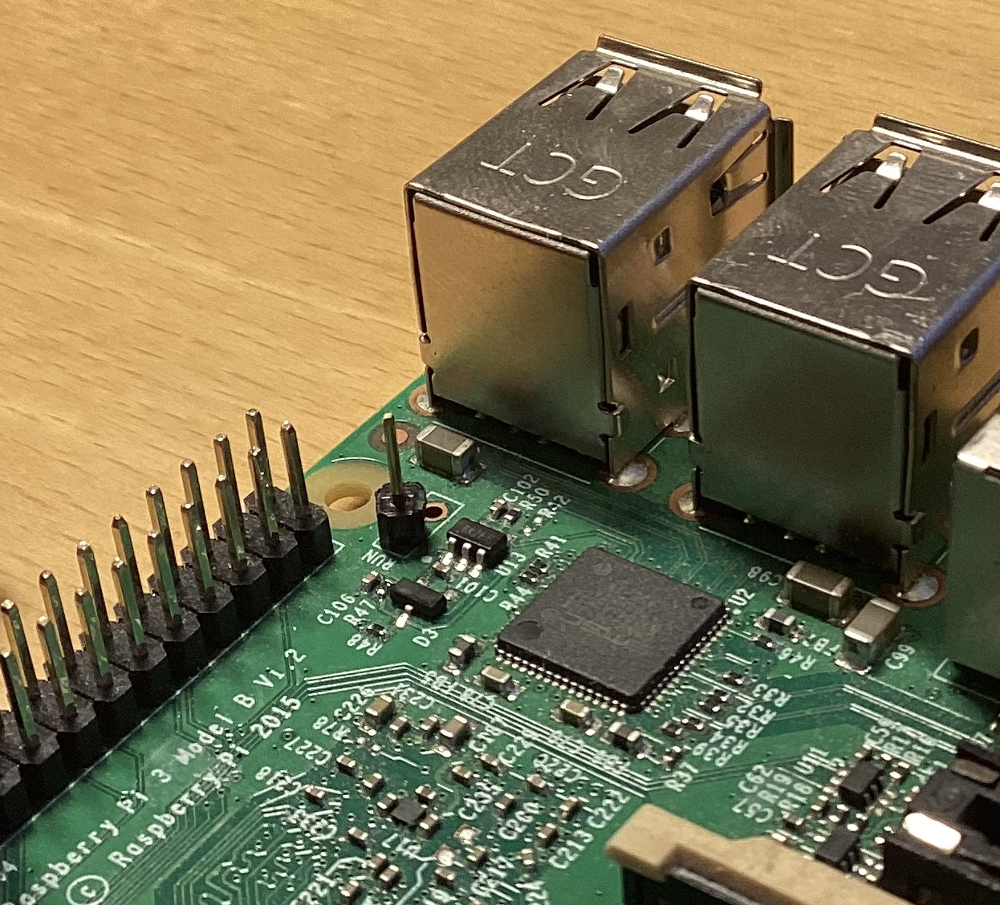
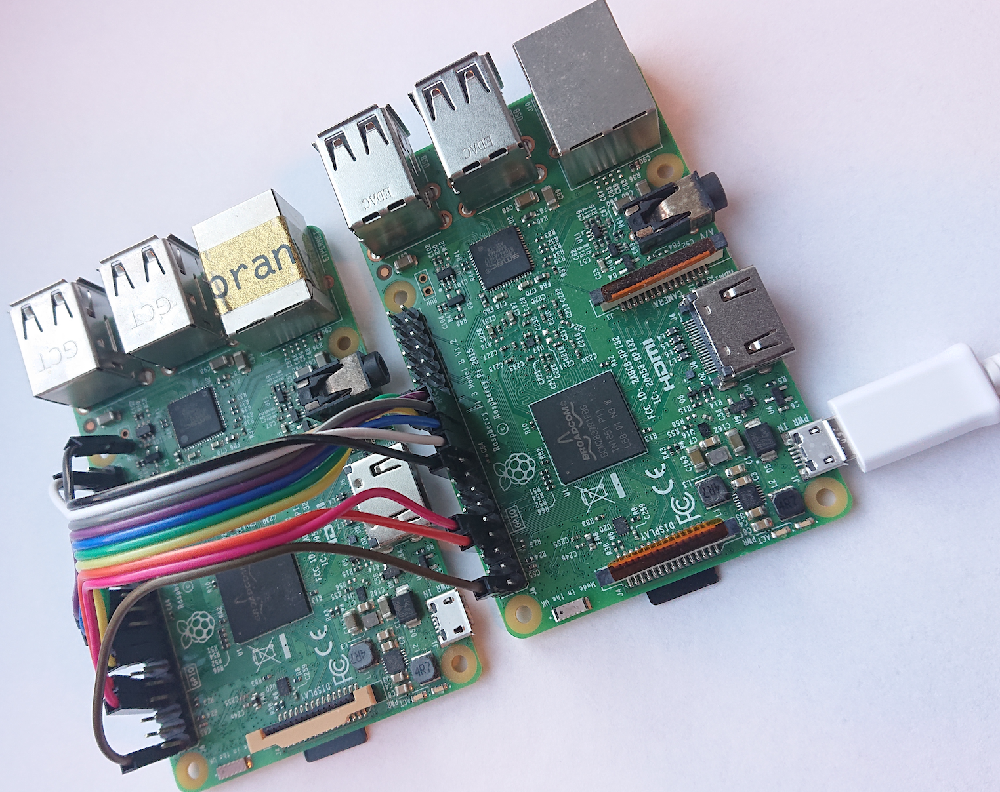

Hardware Setup
==============

The development setup involves two Raspberry Pi Model B boards. One (henceforth known as the ***target***)
will be used to execute the qBeta code under development, while the other (henceforth known as the
***controller***) will control the programming and debugging. The controller will be executing a full Linux
environment (Raspberry Pi OS) and *can* be used as the developer's main PC if this is desired. In the
description below, it is,however, assumed, that the controller will be set up as an SSH server on the local
network (Ethernet or WiFi) and will be accessed and controlled from the developer's main PC located elsewhere.


Bill of Materials
-----------------

 - 2 Raspberry Pi 3 Model B boards
 - 1 Micro SD card, size min. 8 GB
 - 1 Micro SD card, size insignificant
 - 1(!) Power supply 5V to micro-USB capable of delivering 2000 mA.
 - 10 short (ca 10 cm) "DuPont F/F" jump wires
 - 1 Header pin (or piece of stiff wire) soldered onto one of the Raspberry board's "RUN" header
 
> [!NOTE]
> Only a single power supply is needed for this setup, but as always with Raspberry Pis, it is important that
> it can deliver 2000 mA @ 5V. Use either the official Raspberry Pi power supply or make sure that the power
> supply AND the cable live up to these requirements. If any of the red power-status LEDs starts to flicker
> (or turns off completely), the power supply is inadequate.


SD Card Preparation
-------------------

### Smaller card for the target

 - The target card is partitioned with a single bootable partition formatted as FAT32.
 - The contents of the `sleepimage` folder is copied onto the card. This image will start the Raspberry Pi's
   ARM core in 32-bit hypervisor mode (EL2), enable the JTAG port and put all 4 cores to sleep with no further
   action. For further details, see the [`sleepimage` folder's `README.md` file](../sleepimage/README.md).


### Larger card (min. 8 GB) for the controller

 - Install the latest version of the Raspberry Pi OS (recommending the [Raspberry Pi Imager
   tool](https://www.raspberrypi.com/software/) for this step). The -Lite version of the Raspberry Pi OS is
   fine unless you want to use the controller as development PC. All of the following has only been tested on
   the 32-bit version of the Raspberry Pi OS, so use the 64-bit version at your own risk!
 - Set up users, networking, SSH etc. as you would normally do with a Raspberry (or follow one of their
   guides). Below it is assumed that the Raspberry is accessed through SSH. It is recommended to set up SSH
   keys for this to work smoothly.
 - Using the raspi-config tool ("Interface Options" → "Serial Port"), select **no** login shell on the serial
   port, and **yes** to enable the port:
   ```bash
   sudo raspi-config
   ```
 - Install OpenOCD version 0.12 or later:
   ```bash
   sudo apt install openocd
   ```
 - Using your favourite text editor (which you may need to `sudo apt install` first) make the following
   corrections to `/usr/share/openocd/scripts/interface/raspberrypi-gpio-connector.cfg`, which will define the
   controller-side of the setup:
   ```diff
   41c41
   < # adapter gpio trst -chip $_GPIO_CHIP 7
   ---
   > adapter gpio trst -chip $_GPIO_CHIP 7
   44c44
   < # adapter gpio srst -chip $_GPIO_CHIP 24
   ---
   > adapter gpio srst -chip $_GPIO_CHIP 24
   48c48
   < # reset_config trst_and_srst srst_push_pull
   ---
   > reset_config trst_and_srst srst_push_pull
   ``` 
 - Using your favourite text editor make the following corrections to
   `/usr/share/openocd/scripts/board/rpi3.cfg`, defining the target-side of the setup:
   ```diff
   12,13c12,13
   < # Raspberry Pi boards only expose Test Reset (TRST) pin, no System Reset (SRST)
   < reset_config trst_only
   ---
   > # Raspberry Pi boards expose Test Reset (TRST) pin and System Reset (SRST) pin
   > reset_config trst_and_srst srst_push_pull
   ```
 - SMP

> [!NOTE]
> **FIXME**: SMP configuration for GDB / OpenOCD


Wiring
------

With the two SD cards prepared, the connections between the target and controller boards can be made using 10
jumper wires (a.k.a. "DuPont wires") having female connectors at both ends. Due to the high frequency signals,
short wires are preferred! About 10 cm wires are more than adequate to place the two boards on a table next to
each other.

The target Raspberry Pi board needs an extra pin – from the factory it comes with an empty RUN header. So
solder a single pin (or stiff wire of appropriate thickness) into RUN header hole number 1 (closest to the
large GPIO header)



With this extra pin in place, connect the 10 jumper wires according to the following table (colours refer to
the picture below -- yours may of course vary)

| Signal                                | Target Pin    | Controller Pin | Colour | Target GPIO | Controller GPIO |
| ------------------------------------- | ------------- | -------------- | ------ | ----------- | --------------- |
| **Serial data** (Target → Controller) | 8             | 10             | Red    | 14          | 15              |
| **Serial data** (Controller → Target) | 10            | 8              | Orange | 15          | 14              |
| **TCK**                               | 22            | 23             | Gray   | 25          | 11              |
| **TMS**                               | 13            | 24             | Yellow | 27          | 8               |
| **TDI**                               | 37            | 19             | White  | 26          | 10              |
| **TDO**                               | 18            | 21             | Blue   | 24          | 9               |
| **TRST**                              | 15            | 26             | Green  | 22          | 7               |
| **SRST**                              | RUN header #1 | 18             | Black  | –           | 24              |
| **+5V**                               | 2             | 2              | Brown  |             |                 |
| **GND**                               | 20            | 25             | Purple |             |                 |



The power supply is connected to the controller board (only!!) and we are ready to start hacking...
